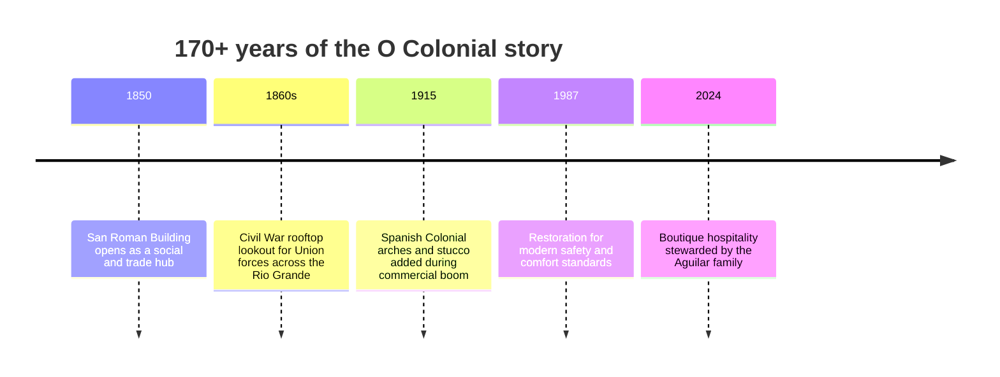
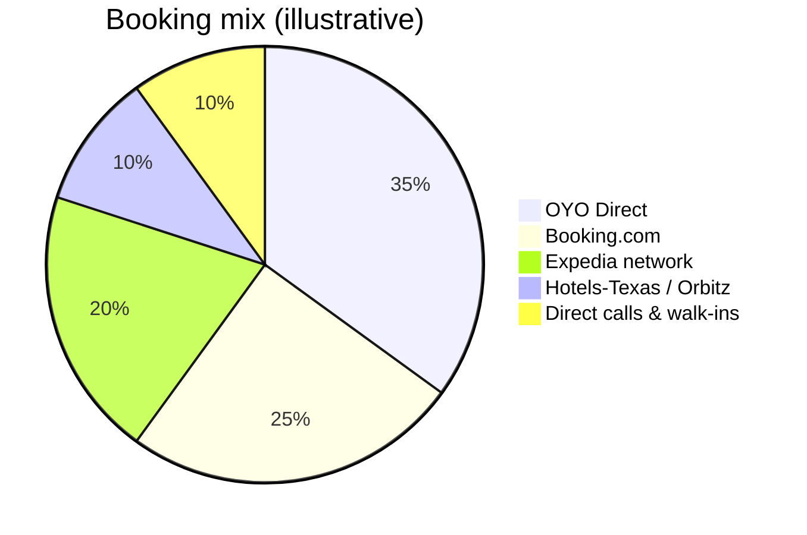
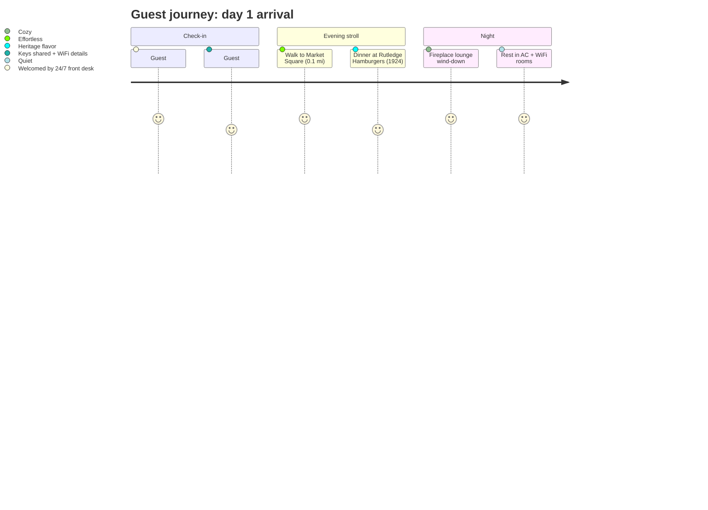
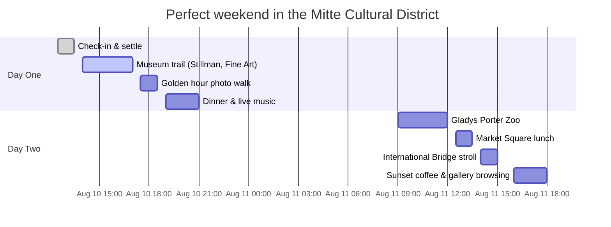

  

  
  
  
  

  <i>1147 E. Levee Street • Brownsville, TX 78520 • 0.2 miles to City Center • Pet-friendly • 24/7 front desk</i>

---

## Table of contents
- [Why guests love it](#why-guests-love-it)
- [Book now](#book-now)
- [Room lineup & pricing](#room-lineup--pricing)
- [Animated experience cues](#animated-experience-cues)
- [Historic timeline](#historic-timeline)
- [Visual data at a glance](#visual-data-at-a-glance)
- [Walkable day plans](#walkable-day-plans)
- [Policies & essentials](#policies--essentials)
- [Contact](#contact)

---

## Why guests love it
- **Living history (1850)**: Original San Roman Building legacy with Civil War rooftop lookout stories and Spanish Colonial arches from 1915.
- **Prime walkability**: 0.2 miles to downtown; minutes to the Mitte Cultural District, museums, the zoo, and the International Bridge to Matamoros.
- **Exceptional value**: Boutique, historic rooms from **$48–$69/night** (plus taxes/fees) with AC, WiFi, 32" TV, and daily housekeeping.
- **Family-run warmth**: Managed by Señor Gonzalo Aguilar and his grandson—guests are welcomed like family, never like a booking number.
- **Pet-friendly + 24/7 help**: Bring the furry family; front desk is always open.
- **Destination gateway**: Quick hop to SpaceX Starbase (~40 min) and South Padre Island (~45 min).

---

## Book now
Primary booking partners (open in a new tab):
- 🌐 **Main website** — https://hotel-o-colonial-website.web.app/
- 🧡 **OYO Direct (best dynamic yields & drip pricing)** — https://www.oyorooms.com/us/317185/
- 🔵 **Booking.com** — https://www.booking.com/hotel/us/colonial-brownsville.html
- 🧭 **Expedia / Orbitz / Travelocity** — https://www.expedia.com/Brownsville-Hotels-Colonial-Hotel.h994435.Hotel-Information
- ☎️ **Talk to the desk (24/7)** — +1 (956) 546-1212

> Tip: Rates fluctuate daily; OYO typically posts the most aggressive nightly deals. All links open externally to keep this site fast and secure.

---

## Room lineup & pricing
Eighteen refreshed, air-conditioned rooms (~150 sq ft each) with WiFi, 32" TV, mini-fridge, and private bath.

| Room Type | Sleeps | Nightly From (promotional / standard rate) | Total w/ Taxes & Fees | Book |
| --- | --- | --- | --- | --- |
| King Bed | 2 | **$43** (rack $69) | ~$54 | [OYO](https://www.oyorooms.com/us/317185/) |
| Full Bed | 2 | **$47** (rack $73) | ~$59 | [OYO](https://www.oyorooms.com/us/317185/) |
| 2 Full Beds | 4 | **$50** (rack $80) | ~$63 | [OYO](https://www.oyorooms.com/us/317185/) |
| 2 Queen Beds | 4 | **$52** (rack $83) | ~$65 | [OYO](https://www.oyorooms.com/us/317185/) |

*Illustrative OYO promotional nightly snapshots ($43–$52 before taxes). Booking.com and Expedia often list $49–$69 before taxes for the same rooms. Always confirm live rates. “Standard rate” (often called the rack rate) reflects the undiscounted rate.*

**Standard amenities (all rooms)**: AC • High-speed WiFi (50+ Mbps) • 32" TV • Mini fridge • Microwave (select rooms) • Private bath • Complimentary toiletries • Daily housekeeping.

---

## Animated experience cues
This README mirrors the motion language planned for the site:
- 🌀 **Parallax hero**: Golden-hour facade glides at 0.5x scroll speed with a soft gradient overlay.
- ✨ **Scroll reveals**: Sections fade-and-rise 20px with 120ms stagger for cards (rooms, experiences, partners).
- 🎞️ **Hover lift**: Cards float +4px with terracotta glow; buttons brighten to ochre.
- 🌙 **Micro interactions**: Focus rings gently scale on inputs; success toasts celebrate with a subtle bounce.
- 🔗 **External link shimmer**: Booking buttons pulse softly to indicate a new tab.

Want motion previews? Swap in lightweight Lottie/GIFs:
- Hero: `https://media.giphy.com/media/3oEjI6SIIHBdRxXI40/giphy.gif`
- Gallery hover: `https://media.giphy.com/media/l0HlOvJ7yaacpuSas/giphy.gif`

---

## Historic timeline

> The original “San Roman Bldg. 1850” engraving still sits beneath the dentil cornice—history etched in stone.

---

## Visual data at a glance

> Note: Dates above are illustrative to keep the two-day itinerary in order; adjust to your travel days as needed.

---

## Walkable day plans
**Everything is truly close:**
- Market Square Research Center — 0.1 mi (2 min)
- Stillman House Museum — 0.2 mi (3 min)
- City Center — 0.2 mi (4 min)
- Immaculate Conception Cathedral — 0.3 mi (5 min)
- Historic Brownsville Museum — 0.6 mi (10 min)
- Gladys Porter Zoo — 1.0 mi (19 min)
- Starbase (SpaceX) — ~40 min drive | South Padre Island — ~45 min drive

See the perfect “hidden pocket of Mexico” stroll

1. **Start**: Coffee in the lobby by the fireplace  
2. **Morning**: Museums + Market Square (pick up artisanal treats)  
3. **Afternoon**: Zoo immersion or Matamoros bridge stroll  
4. **Evening**: Rutledge Hamburgers (since 1924) then live music downtown  
5. **Night**: Gallery lightbox browsing back at the hotel site; unwind under terracotta accents  

---

## Policies & essentials
- **Check-in**: After 1:00 PM | **Check-out**: Before 11:00 AM | **Minimum age**: 18
- **Pet-friendly**: $20 per pet, per night (service animals exempt)
- **Veterans discount**: 15% off for service members
- **Safety**: Fire extinguishers, CCTV in common areas, first-aid kit, daily sanitization
- **24/7 reception** with warm bilingual support

---

## Contact
- **Front desk**: +1 (956) 546-1212  
- **Email**: info@hotelocolonialinn.com  
- **Address**: 1147 E. Levee Street, Brownsville, TX 78520  
- **Map pin**: Steps from the Mitte Cultural District & International Bridge  

  <a href="https://www.oyorooms.com/us/317185/"><b>Book your stay on OYO →</b></a> • 
  <a href="https://www.booking.com/hotel/us/colonial-brownsville.html"><b>See Booking.com photos →</b></a> • 
  <a href="https://www.expedia.com/Brownsville-Hotels-Colonial-Hotel.h994435.Hotel-Information"><b>Compare on Expedia →</b></a>

