  

<h1 align="center">Hotel O Colonial Love – Historic Boutique on the Border</h1>

  <strong>1147 E. Levee Street, Brownsville, Texas 78520</strong> • Steps from Market Square, Stillman House, and the International Bridge to Matamoros

  
  
  
  

> A luminous, lovingly restored 1850 landmark that blends Old-World borderland history with modern comfort, priced for travelers who want both character **and** value.

---

## Table of Contents
- [At-a-Glance Highlights](#at-a-glance-highlights)
- [Immersive Visuals & Data Story](#immersive-visuals--data-story)
- [Rooms, Rates, and Value](#rooms-rates-and-value)
- [Experiences, Amenities, and Services](#experiences-amenities-and-services)
- [Location Intelligence](#location-intelligence)
- [History That Lives On](#history-that-lives-on)
- [Stay Flow & Policies](#stay-flow--policies)
- [Frequently Asked Questions](#frequently-asked-questions)
- [Contact & Quick Actions](#contact--quick-actions)

---

## At-a-Glance Highlights

| ✨ Boutique Strength | 🎯 What It Means For You |
| --- | --- |
| **1850 San Roman Building** with 1915 expansion | Sleep inside a documented piece of Brownsville history and Civil War intelligence lore. |
| **Unbeatable downtown proximity** (0.2 mi to City Center) | Walk to museums, Market Square, zoo, cathedral, and the International Bridge to Matamoros. |
| **Value-first pricing — $48–$69/night** | Historic stay without premium pricing; great for families, students, and business travelers. |
| **18 refreshed, air-conditioned rooms** | King, Full, 2 Fulls, or 2 Queens — each ~150 sq. ft. with WiFi, 32" TV, fridge, and private bath. |
| **Pet friendly** ($20/pet/night; service animals exempt) | Bring your companions; staff is trained to welcome them. |
| **Veterans save 15%** | Year-round appreciation for service members. |
| **24/7 front desk by the Aguilar family** | A multi-generational team that treats every guest like kin. |
| **Fireplace lobby + borderland charm** | Cozy communal glow, Spanish arches, and warm stucco character. |

---

## Immersive Visuals & Data Story

### Booking Mix (Channel Strengths)

### Room Revenue Balance

### Guest Journey (Animated in Your Mind, Interactive in Your Planning)

### Heritage Timeline (Storytelling in One View)

### Daily Rhythm (Operations Flow)

```mermaid
gantt
  title A Day at Hotel O Colonial Love
  dateFormat  HH:mm
  axisFormat  %H:%M
  section Arrival & Welcome
  Front desk ready (24/7)          :done, 00:00, 24h
  Early bag drop (as available)    :active, 10:00, 3h
  Check-in                         :milestone, 13:00, 1h
  section Stay Warm
  Fireplace lounge open            : 12:00, 12h
  Historic walk suggestions        : 09:00, 12h
  section Rest & Recharge
  Quiet hours                      : 22:00, 8h
  Check-out                        :milestone, 11:00, 1h
```

---

## Rooms, Rates, and Value

### Current Rate Range
- **$48 – $69 per night** (plus taxes/fees) — dynamic yield managed by OYO CRS.
- Pet fee: **$20 per pet/night** (service animals exempt).
- **Veterans:** 15% off published rate.

### Room Matrix
| Room Type | Bed | Fits | Amenities | Snapshot Rate* |
| --- | --- | --- | --- | --- |
| King Bed (Non-Smoking) | 1 King | 2 | AC, 32" TV, WiFi, Mini Fridge, Private Bath | From **$54** total (OYO) |
| Full Bed (Non-Smoking) | 1 Full | 2 | AC, 32" TV, WiFi, Mini Fridge, Private Bath | From **$59** total (OYO) |
| 2 Full Beds (Non-Smoking) | 2 Full | 4 | AC, 32" TV, WiFi, Microwave, Fridge, Private Bath | From **$63** total (OYO) |
| 2 Queen Beds (Non-Smoking) | 2 Queen | 4 | AC, 32" TV, WiFi, Microwave, Fridge, Private Bath | From **$65** total (OYO) |

\*Snapshots show recent totals (room + taxes/fees). Rates fluctuate by date and availability.

> **Value Note:** The combination of historic walls, boutique vibe, and downtown walkability at sub-$70 pricing is why repeat guests call this a “hidden pocket of Mexico in South Texas.”

---

## Experiences, Amenities, and Services

**Core comforts in every room**
- Air conditioning • High-speed WiFi (50+ Mbps) • 32" flat screen TV
- Mini fridge; microwave in select rooms • Private bath (tub or shower) • Complimentary toiletries • Daily housekeeping

**Lobby & communal glow**
- Fireplace lounge, archways, stucco warmth, and borderland art references.

**Services**
- 24-hour front desk (Aguilar family team) • Daily housekeeping • On-request local recommendations • Luggage assist

**Pet & family friendly**
- Pets welcome ($20/night) with service animal exemptions. Family rooms (2 Fulls / 2 Queens) support up to 4 guests.

**Sustainability & safety**
- Fire extinguishers across property • CCTV in commons • First-aid kit • Daily sanitization • Historic preservation practices aligned with Brownsville Historical Association guidance.

---

## Location Intelligence

**Walkable Highlights**

| Attraction | Distance | Walk Time |
| --- | --- | --- |
| Market Square Research Center | 0.1 mi | 2 min |
| Stillman House Museum | 0.2 mi | 3 min |
| City Center | 0.2 mi | 4 min |
| University of Texas at Brownsville | 0.3 mi | 5 min |
| Immaculate Conception Cathedral | 0.3 mi | 5 min |
| Historic Brownsville Museum | 0.6 mi | 10 min |
| Gladys Porter Zoo | 1.0 mi | 19 min |

**Gateway Advantage**
- Steps from the International Bridge to Matamoros, ideal for binational business and tourism.
- Quick drives: **BRO Airport (12 min)**, **SpaceX Starbase (~40 min)**, **South Padre Island (~45 min)**.

**Culinary Heritage Nearby**
- **Rutledge Hamburgers (1924)** – 1126 E. Washington St. (classic Texas burgers)
- **Historic Market Square** – farmers’ market, binational heritage cuisine, and modern fusion.

---

## History That Lives On

<strong>Condensed Story (tap to expand)</strong>

- **1850 – San Roman Building** rises as a civic and social hub on Levee Street.  
- **1860s – Civil War intelligence post:** Union forces monitor Matamoros from the rooftop “librería.”  
- **Late 1800s – Social magnet:** saloon, balcony speeches, high-society events.  
- **1915 – Expansion:** aligns with the arrival of the Missouri Pacific Railroad terminal; today’s 8,908 sq. ft. footprint is defined.  
- **1987 – Restoration:** modern safety and comfort without erasing character.  
- **Today – Recognized history:** contributing property in a local historic district; featured on heritage ghost tours (La Matanza lore).

**Why it matters:** You’re staying inside living history—warm stucco, classic archways, and a lobby fireplace that turns every arrival into a homecoming.

---

## Stay Flow & Policies

| Item | Details |
| --- | --- |
| Check-in | After **1:00 PM** (early bag drop subject to availability) |
| Check-out | Before **11:00 AM** |
| Age | Minimum check-in age **18** |
| ID & Payment | Valid photo ID + credit/debit card required |
| Pets | Welcome; **$20 per pet/night** (service animals exempt) |
| Discounts | **15% for Veterans** |
| Front Desk | **24/7** staffed |

---

## Frequently Asked Questions

**Q: Do you have parking?**  
A: Street and nearby public options are readily available; staff will guide you on arrival.

**Q: Is WiFi reliable for work?**  
A: Yes—50+ Mbps typical speeds; many remote workers stay midweek.

**Q: Can I walk to Matamoros?**  
A: Yes—guests frequently enjoy a quick crossing for food and culture via the nearby International Bridge.

**Q: Are there family rooms?**  
A: Absolutely. 2 Fulls and 2 Queens configurations comfortably host up to 4 guests.

**Q: Do you honor late check-out?**  
A: Subject to occupancy; ask the desk and we’ll do our best.

---

## Contact & Quick Actions

- 📞 **Front Desk:** (956) 546-1212  
- 📧 **Email:** info@hotelocolonialinn.com  
- 📍 **Address:** 1147 E. Levee Street, Brownsville, TX 78520  
- 🗺️ **Maps:** [Google Maps](https://maps.app.goo.gl/BTFRYjyx6h2B8gWz7)

  
  
  

> **Come for the history, stay for the warmth.** Hotel O Colonial Love offers the rare blend of vintage soul, borderland energy, and genuinely kind hospitality—all at a price point that lets you explore more of Brownsville and Matamoros.
